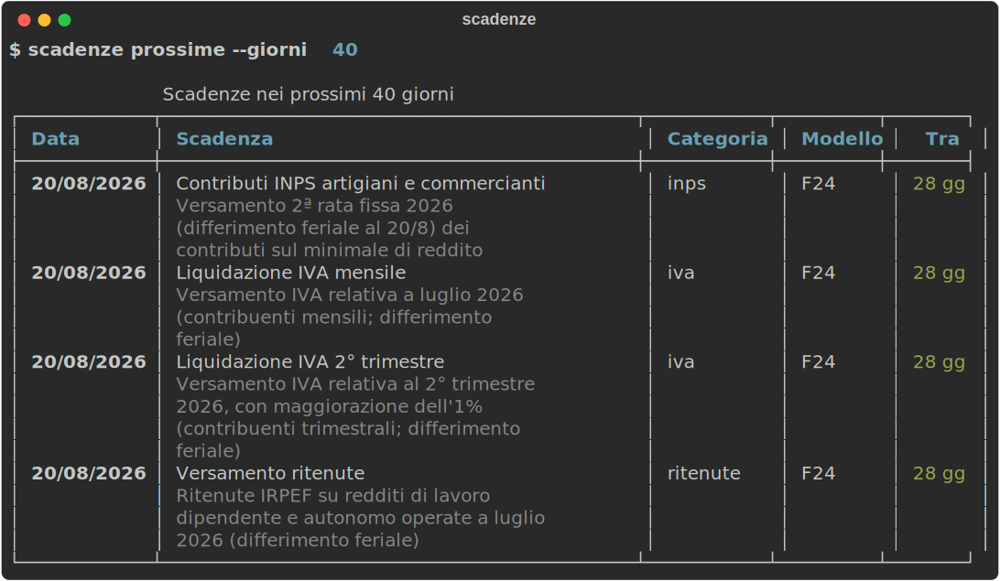

# scadenze

> Le scadenze fiscali italiane 2026, dal terminale.


CLI per consultare le principali scadenze fiscali italiane del 2026: IVA,
ritenute, LIPE, contributi INPS, IMU, dichiarazioni e acconti — con gli
slittamenti per weekend, festivi e differimento feriale già applicati.



## Installazione

```sh
uv tool install scadenze   # oppure: pip install scadenze
```

Per provarlo dal repository senza installare:

```sh
git clone https://github.com/nbflows-managemente/scadenze
cd scadenze
uv run scadenze prossime
```

## Uso

```sh
scadenze prossime                 # scadenze nei prossimi 30 giorni
scadenze prossime --giorni 60
scadenze mese settembre           # anche: scadenze mese 9
scadenze cerca lipe
scadenze --categoria iva prossime # filtra per categoria
scadenze export --ical -o scadenze.ics
```

La colonna **Tra** evidenzia in rosso le scadenze entro 7 giorni.
Il file `.ics` esportato si importa in Google Calendar, Outlook o Apple
Calendar.

**Categorie disponibili**: `iva`, `ritenute`, `inps`, `inail`, `imu`,
`imposte`, `dichiarazioni`, `bollo`, `societa`.

## Il dataset

54 scadenze del 2026 in [un unico JSON](scadenze/data/scadenze_2026.json),
generato da [`scripts/genera_dataset.py`](scripts/genera_dataset.py):

- versamenti mensili F24 (IVA e ritenute) con gli slittamenti 2026:
  18 maggio e 20 agosto (differimento feriale)
- IVA trimestrale, LIPE, bollo fatture elettroniche, rate fisse INPS
  artigiani e commercianti
- scadenze annuali: CU, dichiarazione IVA, IMU, saldo e acconti delle
  imposte (inclusa la proroga al 20 luglio per soggetti ISA e forfettari,
  D.L. 89/2026), 730, Redditi, 770, acconto IVA

Ogni scadenza segue lo schema:

```json
{
  "id": "iva-liquidazione-2026-08",
  "data": "2026-08-20",
  "titolo": "Liquidazione IVA mensile",
  "descrizione": "Versamento IVA relativa a luglio 2026 (contribuenti mensili; differimento feriale)",
  "categoria": "iva",
  "soggetti": ["partita_iva_mensile"],
  "modello": "F24",
  "ricorrenza": "mensile"
}
```

Trovato un errore in una data? Apri una issue o una PR: è il contributo
più prezioso per un progetto come questo.

## ⚠️ Disclaimer

I dati sono forniti **a scopo puramente informativo** e possono contenere
errori o non riflettere proroghe e modifiche normative successive.
Verificare sempre le date sullo
[scadenzario dell'Agenzia delle Entrate](https://www.agenziaentrate.gov.it/portale/scadenzario-fiscale)
o con il proprio commercialista. Questo strumento non sostituisce una
consulenza professionale.

## Roadmap

- [ ] Revisione completa delle date su fonti ufficiali
- [ ] GIF animata del terminale (vhs)
- [ ] Dataset 2027
- [ ] Export CSV
- [ ] Notifiche/reminder

## Sviluppo

```sh
uv sync
uv run pytest                             # 16 test
uv run python scripts/genera_dataset.py   # rigenera il dataset
uv run python scripts/genera_screenshot.py
```

## Chi sono

Progetto di Nimesh Bothalage — [nbflows.com](https://nbflows.com).

## Licenza

[MIT](LICENSE)
